## Pré-Visualização 🔎

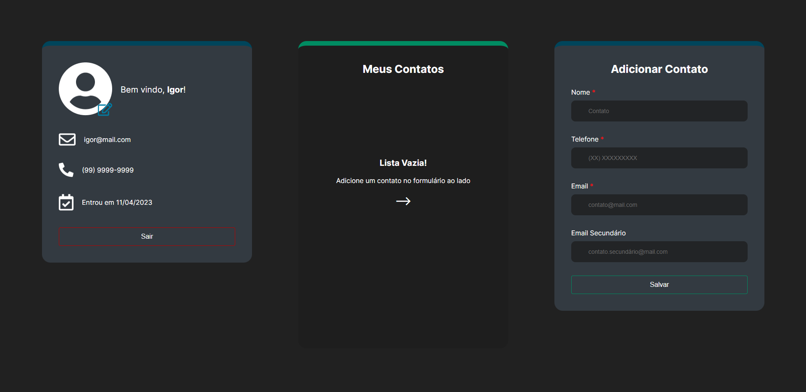

<br/>

# Sobre 📘

Contact Simplifier é uma aplicação feita utilizando Next.ts com intuito de simplificar o gerenciamento dos seus contatos de maneira intuitiva e flúida. Nele, é possível registrar os seus contatos de forma simples e rápida por meio do formulário de cadastro. Este projeto possui um CRUD no frontend para criar, atualizar, deletar e resgatar informações de usuário.

<br/>

<!-- ## `[Aviso]`

Por hora, esta aplicação tem dependência de outra aplicação e só vai funcionar se ambas estiverem presentes e rodando no seu computador. <a href="https://github.com/Igorttdp/Contact-Simplifier-API" target="_blank">Clique aqui</a> para ir até o repositório da `API`. -->

## Estruturação de Projeto e Tecnologias 👩🏻‍💻📂

No frontend deste projeto foram utilizados conceitos do Next.js, entre eles <strong>Roteamento Imperativo</strong>, <strong>SSR (Server-Side Rendering)</strong>, <strong>`_Document` Costumizado</strong> e <strong>`_App` Customizado</strong>

### Tecnologias / Bibliotecas

<ul>
    <li>Axios</li>
    <li>Eslint</li>
    <li>Framer-Motion</li>
    <li>Moment</li>
    <li>Next</li>
    <li>Nookies</li>
    <li>Radix Accordion</li>
    <li>Radix Dialog</li>
    <li>Radix Icons</li>
    <li>React-Hook-Form</li>
    <li>React-Loader-Spinner</li>
    <li>React-Query</li>
    <li>Sharp</li>
    <li>Styled-Components</li>
    <li>TypeScript</li>
    <li>Yup</li>
</ul>

<br/>

## Como Funciona 🔨

<br/>

### `Registro`

Para termos total acesso a aplicação, devemos antes de fazer <strong>login</strong>, devemos nos <strong>registrar</strong>.

<table>
    <tbody>
        <tr>
            <td width="50%">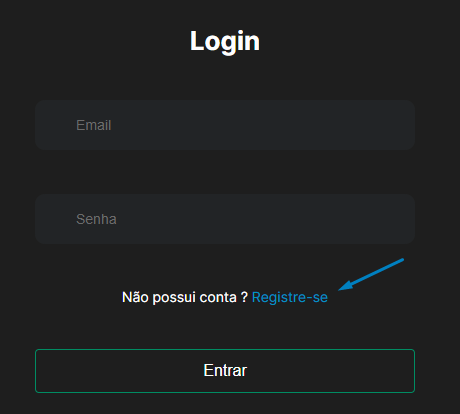</td>
            <td width="50%">No formulário de login você encontra um botão azul escrito <strong>Registre-se</strong>. Clique nele.</td>
        </tr>
        <tr>
            <td width="50%">Após isso, um modal com formulário de registro irá aparecer na tela. É só preencher todas as informações e enviar o formulário! Lembrando que o sinal de asterisco vermelho "*" indica que os campos são obrigatórios.</td>
            <td width="50%">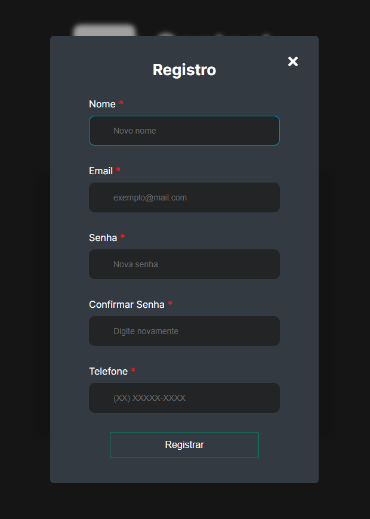</td>
        </tr>
    </tbody>
</table>

<table>
    <tbody>
        <tr>
            <td width="50%">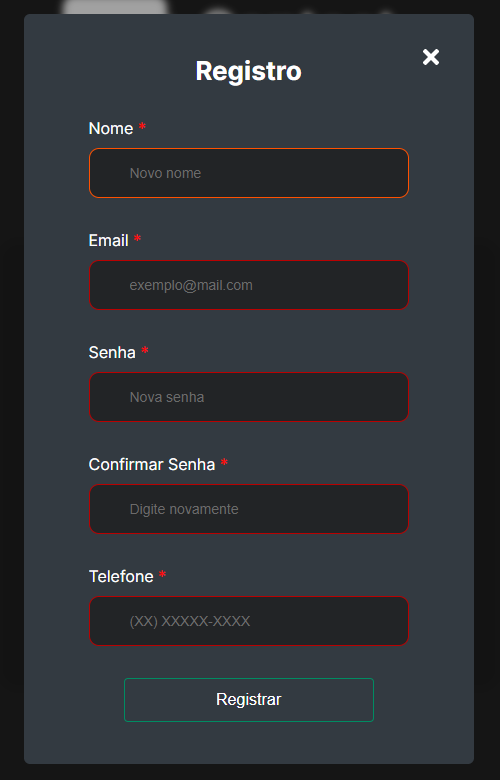</td>
            <td width="50%">Se algum campo não satisfazer as condições mínimas, eles ficarão com a cor vermelha (ou laranja se estiver selecionado), indicando que há algum problema na inserção deste/s dado/s</td>
        </tr>
    </tbody>
</table>

Após o envio das informações validadas, o modal irá retornar uma resposta visual de sucesso ou de erro. Em caso de sucesso, clique no botão "Fazer Login". Em caso de erro, clique no botão "Tente, novamente". Se a aplicação estiver enfrentando problemas de conexão ou de qualquer outra natureza, você pode clicar em "Cancelar" e tentar novamente mais tarde.

<br/>

<table>
    <tbody>
        <tr>
            <td width="50%">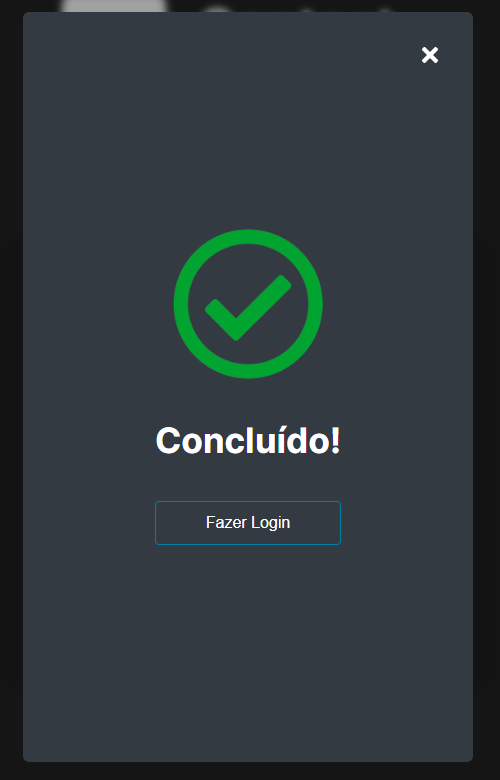</td>
            <td width="50%">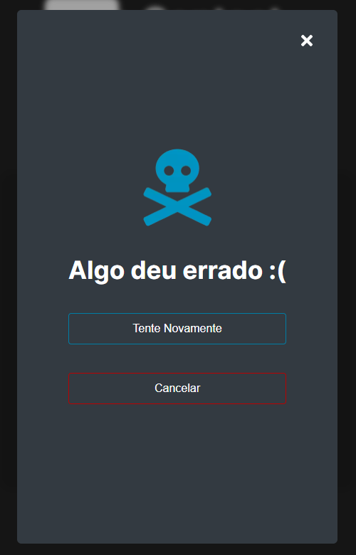</td>
        </tr>
    </tbody>
</table>

<br/><br/>

### `Login`

<table>
    <tbody>
        <tr>
            <td width="50%">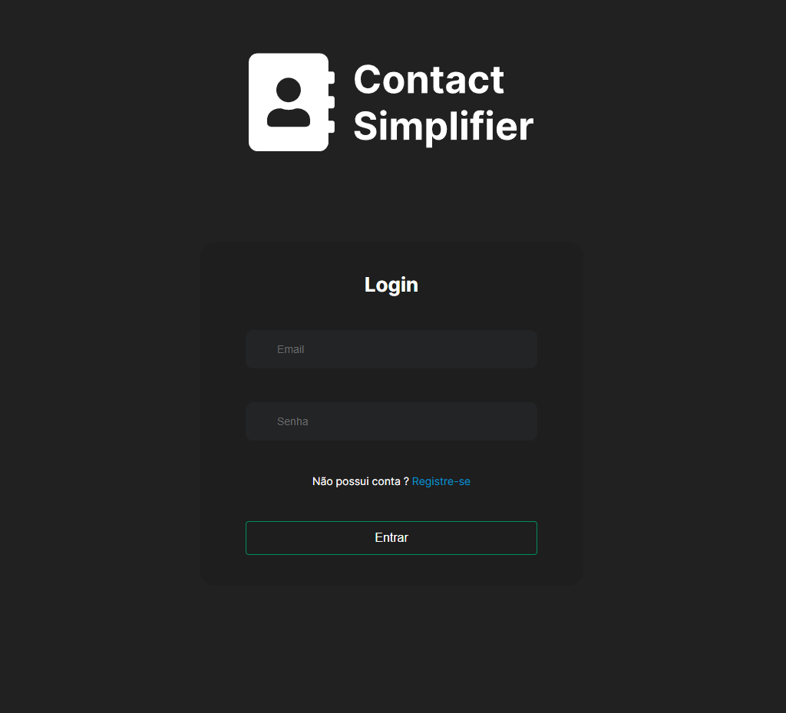</td>
            <td width="50%">Na página inicial encontramos um formulário de login contendo campos de email e senha.</td>
        </tr>
        <tr>
            <td width="50%">Ao inserir os dados os campos mudam de cor conforme a interação e validação dos dados.</td>
            <td width="50%">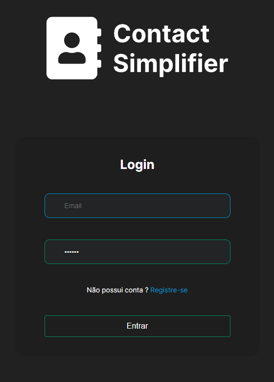</td>
        </tr>
    </tbody>
</table>

Se você preencheu todos os dados corretamente, é só apertar enter ou clicar no botão e esperar até que o servidor te retorne a resposta da solicitação de login.

<br/>

<table>
    <tbody>
        <tr>
            <td width="50%">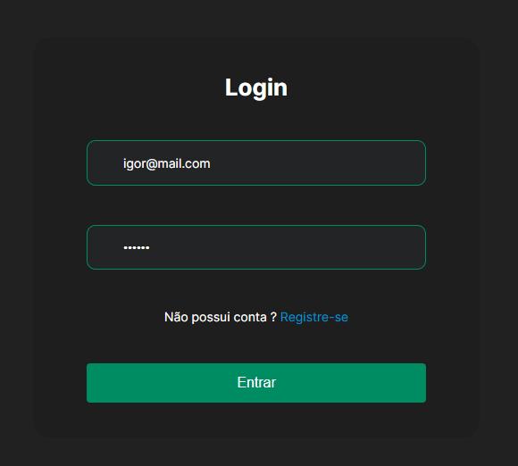</td>
            <td width="50%">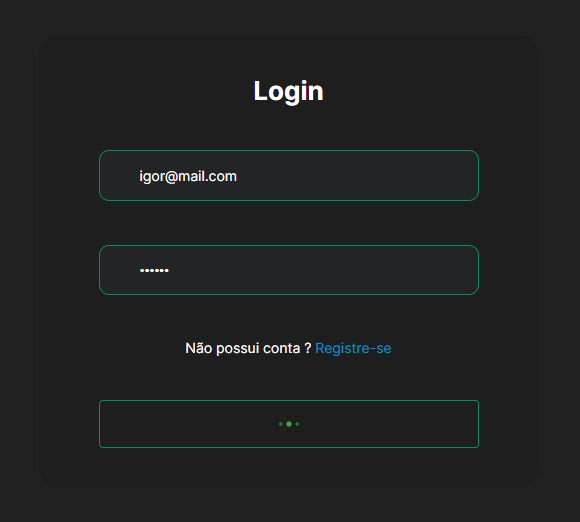</td>
        </tr>
    </tbody>
</table>

Em caso de erro, um toast aparecerá na parte superiora direita da tela, para te notificar que algo deu errado.

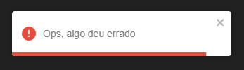

<br/>

Se tudo der certo, você será redirecionado para <strong>Dashboard</strong>!

<br/><br/>

### `Dashboard`

<br/>


Na Dashboard terão 3 pontos de controle (cartões) que tem funções específicas no funcionamento da aplicação. Vamos passar um a um e descobrir suas funcionalidades.

<table>
    <tbody>
        <tr>
            <td width="50%">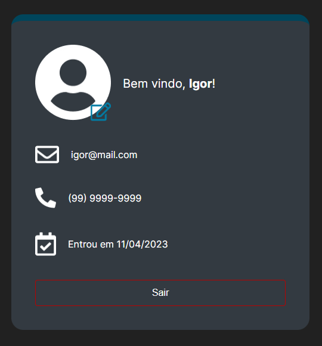</td>
            <td width="50%">Aqui é o cartão do seu perfil. Aqui você encontra suas informações básicas fornecidas no registro como: <strong>Nome</strong>, <strong>Email</strong>, <strong>Telefone</strong>, <strong>Data de ingresso</strong>. Também é possível vizualizar um ícone de lápis para editar suas informações básicas e por fim um botão "sair" para voltar á página de login.</td>
        </tr>
    </tbody>
</table>

### Editando informações Pessoais

<table>
    <tbody>
        <tr>
            <td width="50%">Clique no ícone de edição para abrir o formulário.</td>
            <td width="50%">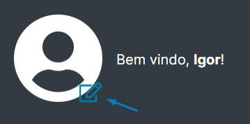</td>
        </tr>
    </tbody>
</table>

<br/>

Aqui você encontra um formulário familiar ao formulário de login e registro. Porém este tem uma funcionalidade de campo retrátil. Basta clicar no campo que quer atualizar que ele irá aparecer abaixo.

<br/>

<table>
    <tbody>
        <tr>
            <td width="50%">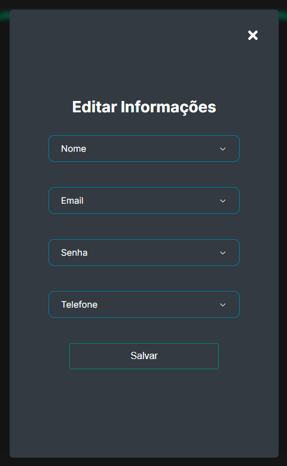</td>
            <td width="50%">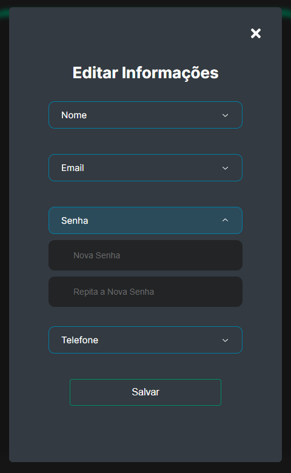</td>
        </tr>
        <tr>
            <td width="50%">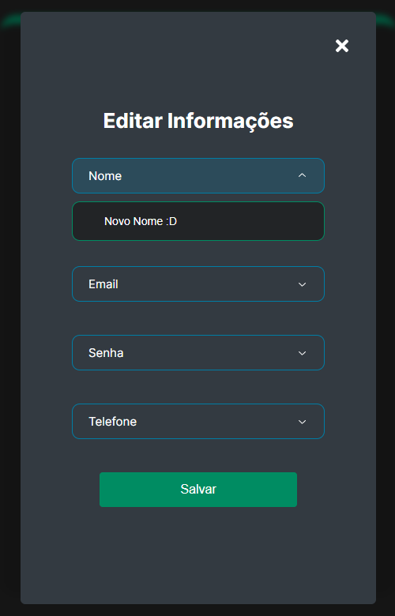</td>
            <td width="50%">Atualize as informações que quiser e após isso clique em salvar!</td>
        </tr>
    </tbody>
</table>

<br/>

Semelhantemente ao formulário de registro, se a resposta da requisição for bem sucedida, será mostrada uma mensagem de sucesso. Caso contrário, será mostrada um toast de erro na parte superiora direita da tela!

<table>
    <tbody>
        <tr>
            <td width="50%">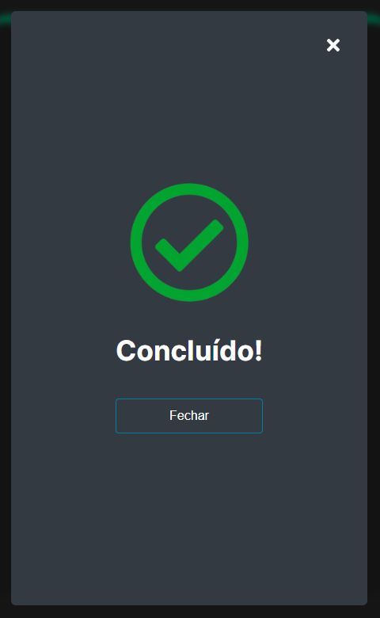</td>
            <td width="50%"></td>
        </tr>
    </tbody>
</table>

### Criando Novos Contatos

Agora vamos para o cartão de <strong>Adicionar Contatos</strong> na parte direita na tela (ou último cartão da direita para esquerda/cima para baixo).

<table>
    <tbody>
        <tr>
            <td width="50%">Aqui temos um formulário que funciona de forma idêntica aos outros. Lembrando que apenas os campos que contém o indicador "*" são obrigatórios, caso o contrário, o campo pode ser deixado vazio.</td>
            <td width="50%">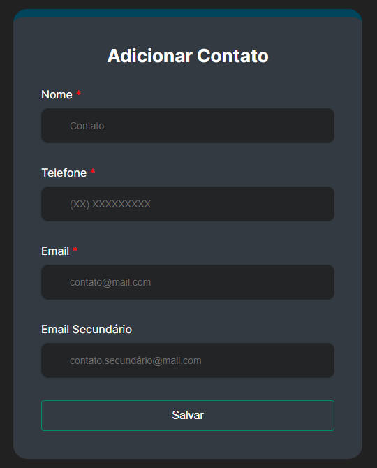</td>
        </tr>
    </tbody>
</table>

Coloque as informações pertencentes ao seu novo contato e após isto clique em "salvar".

<table>
    <tbody>
        <tr>
            <td width="50%">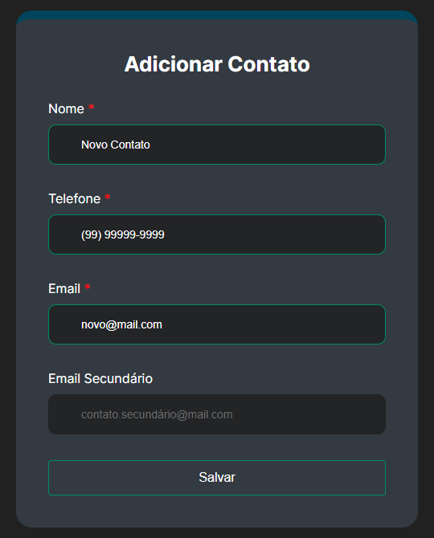</td>
            <td width="50%">Após isto, a resposta da requisição é mostrada com um toast na parte superiora direita da tela. Caso seja bem sucedido, você poderá encontrar seu novo contato listado no cartão central <strong>Meus Contatos</strong>.</td>
        </tr>
        <tr>
            <td width="50%">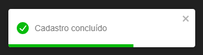</td>
            <td width="50%">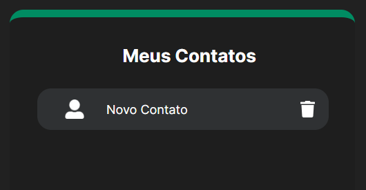</td>
        </tr>
        <tr>
            <td width="50%"></td>
            <td>Caso algo de errado, esta sera a mensagem disparada.</td>
        </tr>
    </tbody>
</table>

<br/><br/>

### Gerenciando contatos

<br/>

### `Aviso`

Este cartão ainda tem funcionalidades a serem desenvolvidas. Logo serão adicionadas mais opções de interação!

<br/>

<table>
    <tbody>
        <tr>
            <td width="50%">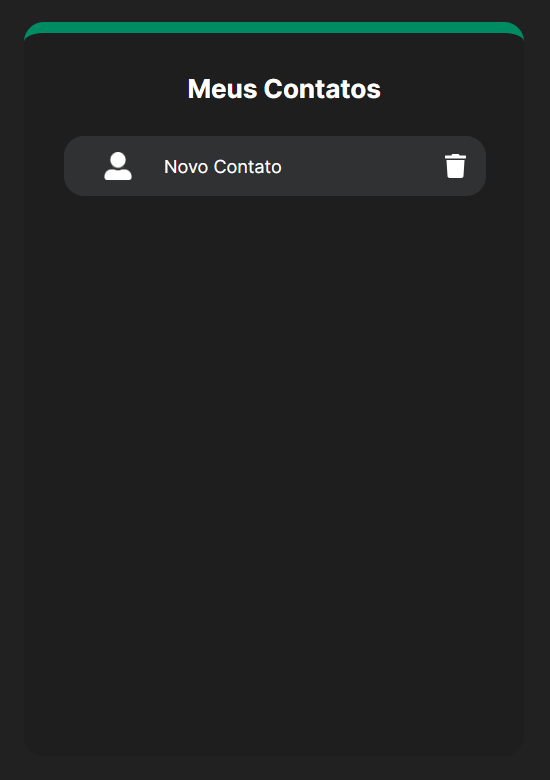</td>
            <td width="50%">Aqui é o cartão <strong>Meus Contatos</strong>. Aqui são listados todos os seus contatos adicionados!</td>
        </tr>
        <tr>
            <td width="50%">Caso queira <strong>excluir</strong> algum contato, basta clicar na lixeira encontrada na parte direta do cartão de contato.</td>
            <td width="50%">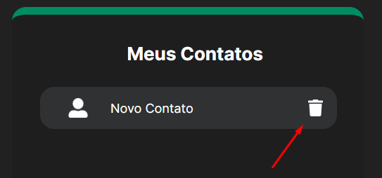</td>
        </tr>
    </tbody>
</table>

<br/>

Caso a requisição seja bem sucedida, um toast de sucesso irá aparecer no canto superior direto da tela e o contato será removido. Neste exemplo, é mostrado que o cartão de "Meus Contatos" está vazio pois só havia um contato cadastrado.

<table>
    <tbody>
        <tr>
            <td width="50%">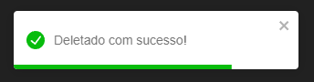</td>
            <td width="50%">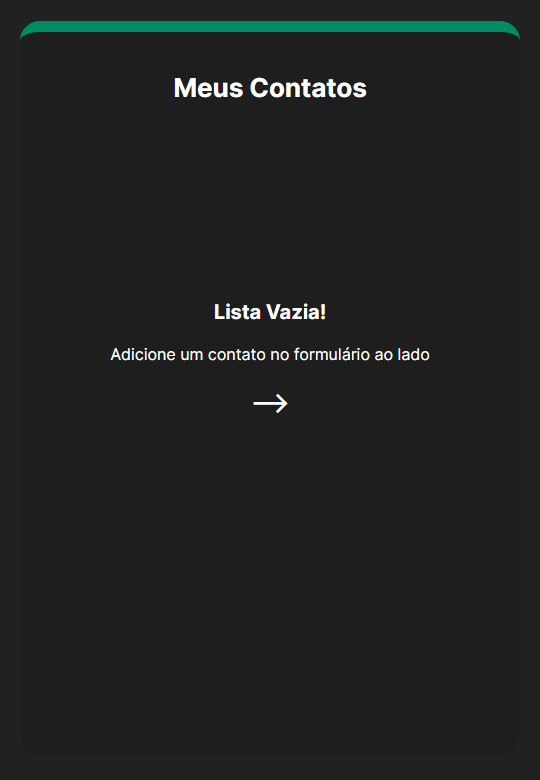</td>
        </tr>
        <tr>
            <td width="50%">Se algo der errado um toast de erro é disparado.</td>
            <td width="50%"></td>
        </tr>
    </tbody>
</table>

<br/><br/>

## Funcionalidades extras

Esta aplicação também funciona perfeitamente no seu laptop, tablet ou celular! Experimente se quiser :D

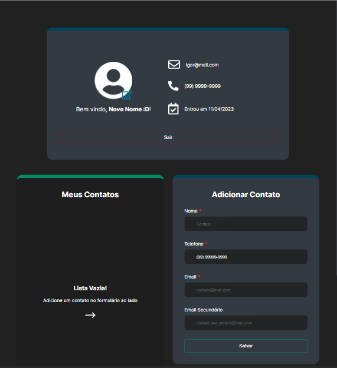

<br/>

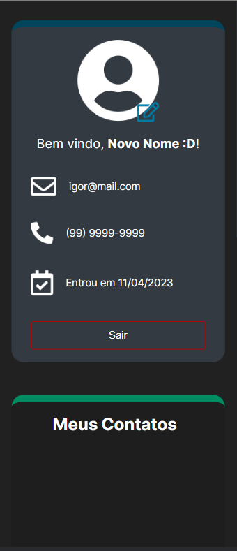

<br/><br/>

## `Como rodar o APP Localmente`

No terminal, digite:

```bash
git clone git@github.com:Igorttdp/Contact-Simplifier.git
```

```bash
cd contact-simplifier
```

<br>

Instale as dependências

```bash
npm install

# ou

yarn install
```

<br>

Inicialize a aplicação:

```bash
npm run dev
# ou
yarn dev
# ou
pnpm dev
```

Abra [http://localhost:3000](http://localhost:3000) no seu navegador para vizualizar a aplicação rodando.
